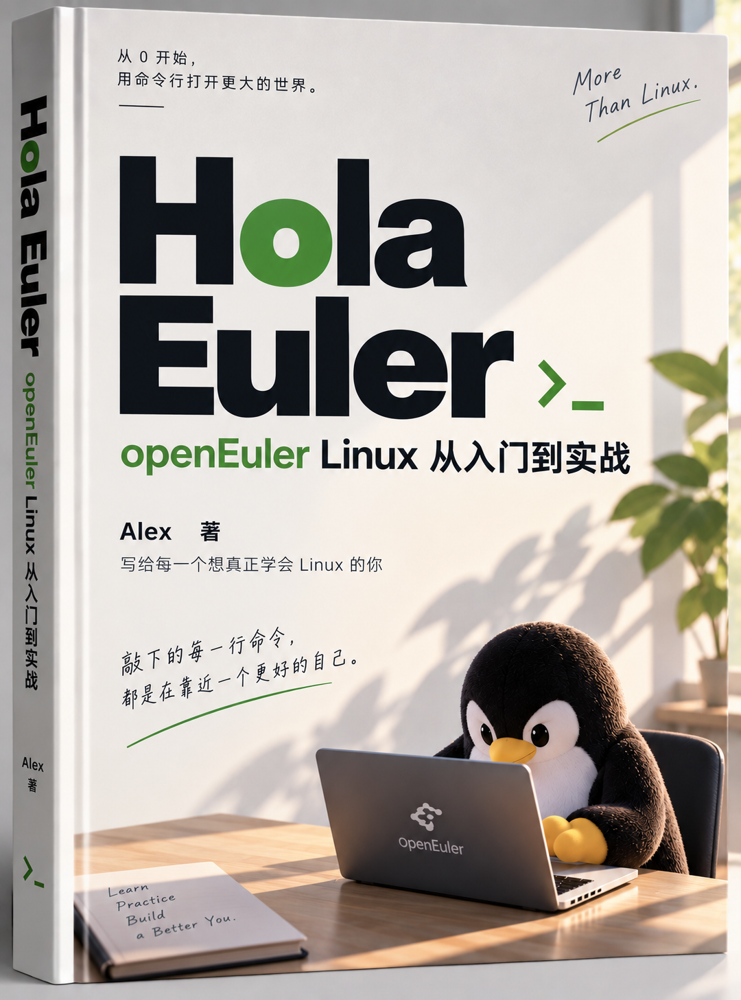

<p align="center">
  
</p>

# Hola Euler

**openEuler Linux 从命令行到服务器实战 · Alex 著**

从建立第一个目录开始，学会查文件、读权限、写脚本，最后在 openEuler 虚拟机中部署一个可以检查、更新和回滚的 Java 服务。

本仓库用于作者与获授权读者共同审阅。当前版本为 **v0.2.0**，共 **136 页 PDF、25 章、150 道练习和答案、20 幅图示**。全文已经过逐章命令审查；openEuler 端到端实测仍待完成。

## 下载与阅读

| 版本 | PDF | EPUB | 说明 |
|---|---|---|---|
| **v0.2.0** | [下载 PDF](downloads/v0.2.0/Hola-Euler-v0.2.0.pdf?raw=true) | [下载 EPUB](downloads/v0.2.0/Hola-Euler-v0.2.0.epub?raw=true) | 修订命令前提、失败处理与部署等待，新增图示和提示框 |
| v0.1-review | [下载 PDF](downloads/v0.1-review/Hola-Euler-v0.1-review.pdf?raw=true) | [下载 EPUB](downloads/v0.1-review/Hola-Euler-v0.1-review.epub?raw=true) | 首轮批阅稿，保留供修订对照 |

PDF 保留固定页码，适合批注和打印；EPUB 支持调整字号，适合手机与电子书阅读器。若浏览器先显示预览，可点击 GitHub 的下载原文件按钮保存。私有仓库下载需要登录具有访问权限的 GitHub 账号，链接不向所有人公开。[SHA256 校验清单](downloads/SHA256SUMS) 可用于检查下载后的文件是否一致。

也可以直接阅读 [完整目录](TOC.md)，从 [第 0 章](chapters/00-preface.md) 开始。

## 内容与学习顺序

| 阶段 | 章节 | 完成后能做什么 |
|---|---|---|
| 认识环境 | 0 至 3 | 确认系统、区分终端与 Shell、找到文件位置 |
| 管好自己的文件 | 4 至 8 | 复制和编辑文件、理解用户与权限 |
| 观察系统 | 9 至 15 | 查询软件包、进程、服务、网络、SSH 与存储 |
| 组合命令 | 16 至 20 | 使用变量、重定向和搜索，写备份与健康检查脚本 |
| 完成部署 | 21 至 24 | 构建 Java 程序，用 systemd 管理服务并练习回滚 |

全书包含 25 章、150 道练习和参考答案、5 个附录。先完成短实验，再解释结果；复习时只看任务描述，从自己的理解写命令。

## 实验环境

- openEuler 24.03 LTS SP4，x86_64，Bash，专用虚拟机。
- 日常使用普通用户，实验目录为 `~/linux-lab`；带 `sudo` 的步骤在相应章节说明目的。
- Java 部分以 JDK 21 为基线。Spring Boot 是可选学习分支，综合项目采用标准 JDK 示例。
- IP、用户名、网卡名、PID 和包版本要按自己的环境查询，不能直接套用截图中的值。

> 看到“待实机验证”，表示该项没有目标系统执行证据。语法检查、资料对照和 Windows 上的运行记录均不能代替 openEuler 验收。

## 源稿与示例

| 位置 | 内容 |
|---|---|
| [chapters](chapters/) | 按章排列的 Markdown 正文 |
| [exercises](exercises/) · [answers](answers/) | 独立练习与答案 |
| [appendices](appendices/) | 命令速查、名称、报错、发行版差异和后续路线 |
| [examples](examples/) | Shell、Java、Spring Boot 与 systemd 示例 |
| [assets](assets/) | 作者提供的封面和原创图示 |
| [scripts](scripts/) | PDF 与 EPUB 构建脚本 |
| [review](review/) | 批阅记录、检查范围和待验证清单 |
| [SOURCES.md](SOURCES.md) | 参考资料、适用版本与来源边界 |

## 构建电子书

EPUB 构建仅需要 Python 3 的标准库。在仓库根目录运行以下命令，读取同一套正文和插图。

```text
python scripts/build_epub.py
```

PDF 构建需要 Python、ReportLab 和可用中文字体；当前脚本使用 Windows 的 SimSun、SimHei、Consolas，不随仓库分发字体。[构建说明](BUILDING.md) 列出依赖、构建命令与验证范围。

## 批阅与技术验证

请按“章节或页码、原句或命令、实际结果、修改建议”提交意见。涉及命令时附系统版本和已去除敏感信息的完整报错。

- [批阅表](review/REVIEW.md)
- [已完成检查](review/QA_REPORT.md)
- [逐章命令审查与 17 项修订](review/COMMAND_REVIEW.md)
- [目标系统验收清单](review/VALIDATION.md)
- [版本记录](CHANGELOG.md)

## 作者与资料说明

作者为 Alex。本书使用 AI 辅助整理资料、写作、核对和排版，保留 Human-AI Collaboration 声明，最终内容由作者审阅。它是独立教材项目，不代表 openEuler 或其他组织的官方出版物。

技术资料优先查阅 openEuler、GNU、Bash、systemd 和相关工具的官方文档。本次对照了 openEuler SP4 的中文快速入门、常用技能、网络配置文档，并参考 [Hello 算法](https://www.hello-algo.com/chapter_preface/suggestions/) 的图解、代码实践与提示框组织方式，正文和图示独立编写。具体对应关系见 [来源记录](SOURCES.md)。

封面由作者提供并指定用于首页。全书暂未选择开放许可证；私有仓库下载仅供获授权读者使用。后续是否公开、采用何种许可，由作者决定。
