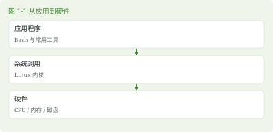

# 第 1 章 Linux 与 openEuler

> 本章任务｜记录发行版、架构与内核，说明它们各自是什么。

## 1.1 让一台虚拟机能够工作

### 1.1.1 内核与发行版各做什么

打开电脑后，编辑器能读文件，浏览器能联网，多个程序能同时运行。它们需要一个共同的管理者分配处理器时间、内存和设备访问。这个核心部分叫内核，英文为 kernel。Linux 是一种开源内核，也常被用来泛指以它为基础的整个操作系统。

单独的内核还不能提供本书全部学习环境。发行版把内核、常用工具、软件包管理系统和安装程序组合起来，并负责版本更新。openEuler 是本书使用的发行版。GNU 项目提供了许多用户空间工具，包括 Bash 和常见文件处理工具。GNU 的名称是递归缩写 GNU's Not Unix，了解这个来源即可，无须背历史年表。

应用程序通常运行在用户态，内核在内核态中执行需要更高特权的工作。程序通过系统调用请求内核读文件或建立网络连接。root 是用户身份，内核态是处理器执行权限层次，二者不能混为一谈。一个以 root 身份运行的普通程序仍主要运行在用户态。



### 1.1.2 确认要下载的版本

本书固定 openEuler 24.03 LTS SP4，不跟随“最新版”自动变更。LTS 表示 Long Term Support，长期支持；SP 是维护版本标识的一部分。核对版本时要保留 SP4，不能只记录 24.03。

从 openEuler 官方下载页进入对应版本与 x86_64 架构目录，选择标准离线安装镜像，并取得对应校验信息。ISO 是安装光盘内容的镜像文件。SHA256 是一种计算文件摘要的方法，下载后计算本地摘要并与官方值逐字符比较，能发现下载损坏或内容变化。摘要来源本身也应可信，不要用同一个陌生网盘提供的文本证明镜像可信。[S01、S02]

## 1.2 完成安装与第一次登录

### 1.2.1 新建专用虚拟机

在自己已有的虚拟化软件中，新建一台 64 位 Linux 虚拟机。作为本书练习的起始配置，可分配 2 个虚拟处理器、8 GiB 内存和 120 GiB 动态分配虚拟磁盘。这是学习配置建议，实际资源需结合宿主机余量与官方安装要求调整。动态分配表示宿主机文件随写入增长，并不意味着虚拟机永远不占空间。

挂载 ISO，启动安装程序。依次检查语言、时区、软件选择、安装目标和网络。选择基础命令行环境即可。安装目标只选择为本实验新建的虚拟磁盘。在确认写盘前核对容量，不把宿主机真实磁盘传给安装程序。保持默认分区方案有助于减少第一次安装的变量，第 15 章再理解它。

网络先采用虚拟化软件的 NAT 模式。NAT 让虚拟机借助宿主机的网络出口访问外部；从宿主机主动连接虚拟机可能还需要端口转发或另一张仅主机网络适配器，第 13 章会展开。

### 1.2.2 用户和管理员

创建普通账户，例如 alex。root 是系统超级用户，家目录通常是 /root；/home/alex 是普通用户 alex 的家目录。给账户设置自己的密码，输入密码时终端不回显星号也可能是正常行为。不要把真实密码写进学习记录。

安装器若提供管理员选项，可给自己创建的实验账户设置管理资格；不同安装选择的 sudo 策略仍需核实。sudo 按策略临时以另一身份执行命令，通常用于 root。它不会因为出现在命令前面就自动获得授权。普通实验不依赖 sudo。安装完成后弹出镜像并重启，确认从虚拟磁盘启动。

> 验证范围｜已确认作者现有虚拟机为 openEuler 24.03 LTS SP4 x86_64，并在该环境完成后续主线运行测试。本轮未重新运行 ISO 安装器，也未复现普通账户输入密码取得 sudo 的交互；安装页面、安装时的软件选择和该交互流程单独保留为未验收项。

## 1.3 证明自己进入了哪台系统

### 1.3.1 三条只读命令

```bash
cat /etc/os-release
uname -m
uname -r
```

cat 关联 concatenate，原意是把输入连接起来输出，这里用于读取一个文本文件。/etc/os-release 保存发行版标识。uname 关联 Unix name，用于查看系统信息；-m 查看机器硬件名称，-r 查看内核发布版本。观察时分别记录发行版、架构和内核，别把内核版本当成 openEuler 的发行版本。

如果 uname -m 不是 x86_64，请回头确认镜像和虚拟机架构。某些 ARM 电脑使用的是 AArch64 虚拟机，很多命令仍相同，但这与本书固定的验证环境不同。先记下差异，再决定是否重建符合本书条件的实验机。

### 1.3.2 保存一个干净起点

在虚拟机软件里创建安装完成后的快照，并给它写一段说明，记录用户、网络方式和系统版本。后面实验出错，可以比较更改前后的状态。快照恢复会撤销其后磁盘上的实验文件，因此重要笔记另存一份。

## 1.4 本章练习

- 不要往前翻｜内核、发行版和 Bash 分别负责什么？
- 命令填空｜查看处理器架构使用 uname ______。
- 看需求写命令｜读取发行版标识，并单独查询内核版本。
- 看命令猜结果｜uname -r 会告诉你账户密码吗？它输出哪一类信息？
- 找错误｜“我是 root，所以我的编辑器一直在内核态运行”，错在哪里？
- 无提示实操｜记录自己的发行版、SP 标识、架构和网络方式，制作干净快照。

本章新命令为 cat / concatenate、uname / Unix name。保留第 0 章的实验目录。明天登录后，先不用笔记找回它。

资料依据见 S01、S02、S04、S12。答案见第 1 章答案。
