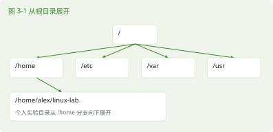

# 第 3 章 Linux 文件系统与路径

> 本章任务｜从两个不同起点找到同一个目录，解释路径为何不同。

## 3.1 我现在在哪里

### 3.1.1 一棵从斜杠开始的目录树

文件要有名称，也要有位置。Linux 用目录组织位置，目录里还能包含目录。整个命名空间从 / 开始，这个位置叫根目录。/home、/etc 和 /var 都从这棵树向下展开。文件系统既可以指组织与保存文件的技术，也常用于讨论这棵可访问的目录树；磁盘与挂载的关系留到第 15 章。



/etc 主要保存系统配置，/var 保存许多会变化的数据和日志，/usr 包含大量系统提供的程序与资源。/tmp 用于临时文件，其清理策略由系统决定，不适合保存长期作业。/root 是 root 用户的家目录，不能把它与 / 画等号。

### 3.1.2 工作目录是相对路径的起点

```bash
cd ~/linux-lab
mkdir -p paths/notes
cd paths
pwd
cd notes
pwd
```

第一行回到统一工作区。mkdir -p paths/notes 在其中建立两层目录。执行 cd notes 时，Bash 从当前的 paths 目录查找 notes。这个隐含起点叫当前工作目录。最后一次 pwd 应比前一次多一个 /notes。

## 3.2 同一个文件可以有几种写法

### 3.2.1 绝对路径与相对路径

以 / 开头的路径是绝对路径，从根目录开始找。相对路径从当前工作目录开始找。假如当前目录是 /home/alex/linux-lab，paths/notes 就是相对路径。此处的 alex 是示例用户名，你的家目录可能不同。

```bash
cd ~/linux-lab/paths/notes
cd ..
pwd
cd .
pwd
cd ~
pwd
```

.. 表示上一级目录，. 表示当前位置。cd .. 后回到 paths，cd . 不改变位置。~ 是 Shell 的家目录展开语法，在这里简化了输入。/ 是系统根目录，~ 随当前用户变化。不要把 ~ 写在单引号中期待它仍然展开。


### 3.2.2 走错路时怎样检查

```bash
cd ~/linux-lab/paths
cd missing
pwd
```

missing 尚未创建，预期出现 No such file or directory 一类报错。失败的 cd 不会自动进入别处。此时 pwd 仍应显示 paths。继续操作前先确认位置，尤其不要因为一条 cd 失败就让后续删除命令在错误目录执行。

## 3.3 大小写与空格都属于名字

### 3.3.1 让 Shell 把名字看完整

```bash
cd ~/linux-lab/paths
mkdir 'reading notes'
cd 'reading notes'
pwd
```

单引号保护中间的空格，mkdir 得到一个名称参数。若写成 mkdir reading notes，它会创建两个目录。常见 Linux 文件系统区分大小写，Notes 与 notes 可能是两个位置。不要依赖 Windows 文件管理习惯推断结果。

### 3.3.2 返回家目录再重来

cd 不带参数通常也会回到家目录，cd - 可以切回上一个工作目录。前者是 home 的快捷入口，后者依赖此前的切换记录；刚启动 Shell 时不一定已有可用的上一个目录。初学阶段先多用完整路径与 pwd，等位置感建立后再减少查询。

## 3.4 本章练习

- 不要往前翻｜/、/root、~ 有什么区别？
- 命令填空｜返回上一级使用 cd ______。
- 看需求写命令｜从任何位置进入家目录中的 linux-lab/paths/notes。
- 看命令猜结果｜在 paths 中执行 cd notes 后再执行 cd ..，回到哪里？
- 找错误｜cd reading notes 为什么不能按预想进入一个含空格的目录？
- 无提示实操｜建立 project/src 和 project/docs，进入 src，用相对路径进入 docs，再用绝对路径思想解释自己的位置。

本章复用 mkdir、cd、pwd，无须新增命令。一天后换一组目录名再做任务，保留实际路径记录。

资料依据见 S03、S04。答案见第 3 章答案。
