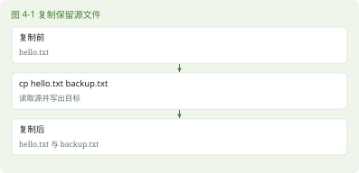
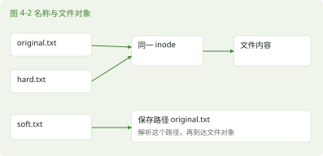

# 第 4 章 文件与目录操作

> 本章任务｜完成一次复制、移动和链接实验，能指出文件最终在哪里。

## 4.1 为一份文件建立副本

### 4.1.1 创建并看见它

```bash
mkdir -p ~/linux-lab/files
cd ~/linux-lab/files
touch hello.txt
ls -l
```

touch 的英文意思是触碰，它的主要用途是更新文件的访问时间或修改时间。目标不存在且父目录可写时，它会创建空文件；已有内容不会因此清空。[S04a] ls 可与 list 关联，列出目录内容。-l 选择长格式。

长格式通常依次包含类型与权限、硬链接数、所有者、所属组、大小、时间和名称。普通空文件的大小应为 0 字节。第一列以 - 开头通常表示普通文件，以 d 开头表示目录。各列的具体值取决于系统，暂时不用背权限串，第 8 章会逐位拆解。

### 4.1.2 复制时源在前、目标在后

```bash
cp hello.txt backup.txt
ls -l
```

cp 是 copy 的缩写。hello.txt 是被读取的源，backup.txt 是写出的目标。复制后两个名称都应存在，之后修改其中一份通常不会改变另一份的内容。目标如果已经存在，普通 cp 可能覆盖它；练习前检查文件名，想在覆盖前确认可用 cp -i。



## 4.2 改名字与搬位置

### 4.2.1 mv 的两种常见使用方式

```bash
mv backup.txt draft.txt
mkdir archive
mv draft.txt archive/
ls archive
```

mv 关联 move。第一次把文件名称从 backup.txt 改为 draft.txt，第二次把它移入 archive 目录。archive/ 后的斜杠表明期望目标是目录，可以帮助发现把目录误写成文件的情况。同一文件系统内的移动常能直接调整目录项，跨文件系统移动则可能需要复制数据再删除源，因此不要把所有 mv 都理解成瞬间完成。

### 4.2.2 复制目录需要明确递归

```bash
cp -r archive archive-copy
ls archive-copy
```

-r 与 --recursive 在 GNU cp 中表示递归，把目录内容逐层复制。这里 archive-copy 事先不存在，所以成为副本根目录。如果它已经是目录，目标层次可能多出 archive 这一层。重做实验时先查看现有目录，再预测结果。[S04b]

## 4.3 删除之前确认对象

### 4.3.1 从一个文件开始

```bash
pwd
ls -l hello.txt
rm -i hello.txt
```

rm 关联 remove，移除名称。-i 请求逐项确认，确认提示的具体语言因区域设置而异。只在确认目标是本章空文件后同意。命令行删除通常没有桌面回收站，不能把 -i 当作备份。不要在初学时用递归强制删除整理整个实验目录。

rmdir 关联 remove directory，只删除空目录。运行 rmdir archive 时，如果里面还有 draft.txt，预期会得到 Directory not empty 一类错误。这个拒绝能帮助你发现目录中仍有文件。先列出、逐项处理自己创建的文件，再删除空目录。

### 4.3.2 两种链接

```bash
printf '%s\n' 'version one' > original.txt
ln original.txt hard.txt
ln -s original.txt soft.txt
ls -li original.txt hard.txt soft.txt
```

这一处先使用 > 把文字保存到文件，若同名文件存在会覆盖；第 17 章完整解释。ln 与 link 关联，默认创建硬链接；-s 表示 symbolic，创建符号链接。-i 让 ls 显示 inode 编号，inode 是文件系统管理文件元数据的对象，名称通过目录项关联到它。

硬链接为同一个文件对象增加名字，通常不能跨文件系统，普通用户也不应给目录建立硬链接。软链接保存目标路径，可指向目录，也可跨文件系统。相对软链接路径以链接所在目录为起点解析。删掉 original.txt 后，hard.txt 仍关联原对象，soft.txt 的路径则可能失效。文件在最后一个硬链接被移除、且不再被进程持有等条件满足后，空间才真正得到释放。



## 4.4 本章练习

- 不要往前翻｜touch 已有文件会清空内容吗？
- 命令填空｜复制目录使用 cp ______ source target。
- 看需求写命令｜把本章已创建的 original.txt 复制为 original.bak，再把副本移入 archive。
- 看命令猜结果｜对同一个文件创建两个硬链接，修改其中一名所指内容后另一名会看到什么？
- 找错误｜rmdir 报 Directory not empty 时，直接加不存在的“强制参数”合适吗？
- 无提示实操｜在新目录中创建一份有内容的笔记，复制、重命名、归档，检查两份内容，最后只删除你指定的副本。

本章新命令与英文关联为 touch / 触碰并更新时间、ls / list、cp / copy、mv / move、rm / remove、rmdir / remove directory、ln / link。七天后的复习任务可以是整理自己的实验笔记。

资料依据见 S04、S04a、S04b、S12。答案见第 4 章答案。
