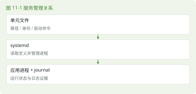

# 第 11 章 systemd 与服务

> 本章任务｜把已启用、正在运行和应用可用三种状态分开判断。

## 11.1 关掉终端以后谁照看程序

### 11.1.1 服务与管理器

SSH 登录服务、定时任务和应用后端往往需要在没有人打开终端时继续工作。服务是系统提供的一项持续或按需运行的功能，可以由一个或多个进程实现。systemd 是一套系统和服务管理组件，末尾 d 沿用 daemon 的命名习惯；daemon 通常指在后台提供服务的程序。

systemd 用 unit，即单元，描述管理对象。.service 是服务单元，.socket 可以描述监听套接字，.timer 可以安排定时触发。现在先掌握 service。systemctl 是控制管理器的命令，ctl 与 control 关联；journalctl 用来查询 journal 日志。



### 11.1.2 确认管理器

```bash
ps -p 1 -o comm=
systemctl --version
systemctl list-units --type=service --state=running
```

PID 1 是系统的第一个用户空间进程，在本书目标环境中应核对它是否为 systemd。容器或特殊裁剪环境可能不同。如果显示无法连接总线、未以 systemd 启动，应先确认是否进入了容器或其他环境，不能把命令不通归结为拼写问题。

## 11.2 查询与变更要分开理解

### 11.2.1 start 与 enable 不回答同一个问题

start 请求现在启动，stop 请求现在停止。enable 配置适当的启动依赖关系，通常用于以后开机自动启动，并不总是立即运行。enable --now 组合配置与立即启动。disable 通常也不自动停止当前进程。is-active 查询当前活动状态，is-enabled 查询启用状态。

本章先查询，不停止系统自带关键服务。后面的 labapp.service 是我们自己建立的单元，届时再练习 start、stop 和 restart。restart 会中断正在处理的请求，修改远程访问服务尤其需要保留可恢复入口。

### 11.2.2 读取单元和日志

```bash
systemctl status sshd.service --no-pager
systemctl cat sshd.service
sudo journalctl -u sshd.service -n 30 --no-pager
```

本节以 sshd.service 为候选，先确认本机确实存在这个单元。status 显示状态摘要，cat 查看加载的单元文件及覆盖配置。journalctl -u 按单元筛选，-n 30 取最近 30 条，--no-pager 直接输出而不进入分页器。普通用户可能无权查看完整系统日志，所以查询时按本机策略使用 sudo。日志可能包含账户与地址，分享之前先检查。

## 11.3 最小单元文件怎样表达一个程序

### 11.3.1 读懂后续部署模板

```ini
[Unit]
Description=Linux lab Java application
After=network.target

[Service]
Type=simple
User=labapp
WorkingDirectory=/opt/labapp/current
ExecStart=/usr/bin/java -jar /opt/labapp/current/app.jar
Restart=on-failure
RestartSec=3

[Install]
WantedBy=multi-user.target
```

这份模板暂时只读，第 24 章创建用户和文件后再使用。Unit 描述单元及顺序关系，Service 描述进程，Install 说明启用时连接到哪个目标。User 指定运行账户，WorkingDirectory 给相对路径一个明确起点，ExecStart 写实际启动命令。Restart=on-failure 在异常退出时尝试重启，但不能保证应用能自动修复错误。

After 只表达顺序，不单独拉起另一个单元，也不保证网络已可访问互联网。Type=simple 下 systemd 可以较早认为启动已开始，仍要做应用层健康检查。ExecStart 默认不交给交互式 Bash 解释，不能随意塞入 >、| 或 ~ 并期待与终端相同。

### 11.3.2 修改单元与修改程序

修改单元文件后，需要 daemon-reload 让管理器重新读取单元定义；它不会自动重启已有程序。修改应用自己的配置，则应按应用支持的机制 reload 或 restart。reload 并非每个服务都支持。把这三类动作分清，排错会少很多歧义。

> 实机核验｜【待 openEuler 24.03 LTS SP4 实机验证】单元名称、systemd 版本、日志权限和最终服务模板必须在目标环境执行核查。

## 11.4 本章练习

- 不要往前翻｜start、enable、daemon-reload 分别改变什么？
- 命令填空｜查看某单元日志使用 journalctl ______ labapp.service。
- 看需求写命令｜查询 sshd.service 的状态与最近 20 条日志。
- 看命令猜结果｜enable 一个服务后，它必定已经处理请求了吗？
- 找错误｜ExecStart 中直接写 java ... > app.log 为什么不能按 Bash 方式理解？
- 无提示实操｜只读检查一个实际存在的服务，记录单元位置、主进程、当前状态和最近一条日志的含义。

本章新命令为 systemctl / system control、journalctl / journal control。复用 ps 与权限知识，七天后再解释一次服务“启用”与“可用”的区别。

资料依据见 S09、S10。答案见第 11 章答案。
