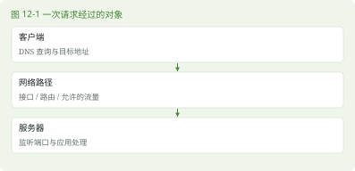

# 第 12 章 Linux 网络基础

> 本章任务｜根据地址、路由、名称和端口逐步收窄网络问题。

## 12.1 为什么程序说连不上

### 12.1.1 先把四个对象分开

网卡是网络接口，IP 地址帮助定位网络中的接口，路由决定数据下一步往哪里走，端口帮助把到达主机的流量交给对应程序。DNS 把域名解析成地址等记录。域名能解析，不代表端口开放；端口有监听，也不代表应用能正常处理请求。

IPv4 地址如 192.168.56.10，/24 是网络前缀长度，表示前 24 位属于网络前缀。这里的地址仅用于说明，实验应替换成自己虚拟机实际获得的地址。127.0.0.1 是本机回环地址，从另一台电脑访问它，连接的是那台电脑自己。



### 12.1.2 逐层观察

```bash
ip -brief address
ip route
nmcli device status
nmcli connection show
```

ip 的名称关联 Internet Protocol，来自 iproute2 工具集；address 显示接口地址，route 显示路由。-brief 压缩输出。nmcli 是 NetworkManager 的命令行接口，device 显示设备，connection 显示连接配置。设备名与连接名可能不同，不要把网卡一律写成 eth0。

## 12.2 从本机到应用逐步检查

### 12.2.1 地址、路由与名称

先确认接口存在、处于可用状态并获得地址，再看默认路由。虚拟机若使用 NAT，网关通常来自虚拟化软件的虚拟网络。不要把网上的网关地址照搬到自己环境。

```bash
getent hosts www.openeuler.org
ping -c 3 127.0.0.1
```

getent hosts 通过系统名称服务查询地址。ping 是发送回显请求的诊断工具，名字来自回声探测的说法，不需要把它硬展开成一个正式英文缩写。-c 3 限制次数。ping 本机成功只能证明这一小段回环路径可用，ICMP 被阻止时 ping 失败也不能直接证明 Web 服务不可达。

### 12.2.2 检查监听端口与 HTTP

```bash
ss -ltn
curl -I --connect-timeout 5 --max-time 15 \
  https://www.openeuler.org/
```

ss 可与 socket statistics 关联，用于查看套接字信息。套接字是程序进行网络通信使用的接口对象。-l 查看监听，-t 选择 TCP，-n 用数字显示地址端口。TCP 是提供可靠字节流传输的协议，HTTP 是常用于网页和接口请求的应用协议。

curl 是数据传输工具，名称可按项目的 client URL 关联记忆。-I 请求 HTTP 响应头，--connect-timeout 限制建立连接阶段的等待时间，--max-time 15 把整个请求限制为 15 秒。证书错误需要检查系统时间、可信证书与访问目标，不能用 -k 作为常态解决方案。离线环境无法访问外部网站时，仍可在第 22 章用本机服务练习。

## 12.3 NetworkManager 的配置与状态

### 12.3.1 一个配置可以暂时不被启用

NetworkManager 的 connection 是一组保存的网络设置，device 是实际接口。一个接口可以对应多份备用配置，通常同一时刻采用其中一份。nmcli connection show --active 显示正在使用的配置。查询得到的名称可能含空格，作为参数时需要引号。

### 12.3.2 配置变更应保留退路

远程改地址或断开连接会切断自己的 SSH。初次修改网络请在虚拟机控制台操作，先记录现有地址、网关、DNS 和连接 UUID。UUID 是用来唯一标识配置的一串标识符。确认虚拟网络地址规划后再使用 nmcli connection modify，应用修改也可能使当前连接断开。

本书不提供一个假定适合所有人的静态 IP 命令。地址冲突、网关错误和子网不匹配都需要具体网络信息。第 24 章保持可用的 DHCP 配置，通过 SSH 隧道访问应用即可完成部署学习。DHCP 是自动向主机提供地址等网络配置的协议。

> 实机核验｜【待 openEuler 24.03 LTS SP4 实机验证】NetworkManager 是否安装启用、nmcli 版本、接口名和连接存储方式，以目标系统为准，不照搬旧网络脚本路径。

## 12.4 本章练习

- 不要往前翻｜IP 地址、端口、DNS 与路由分别解决什么问题？
- 命令填空｜查看路由使用 ip ______。
- 看需求写命令｜查看接口地址、活动连接以及 TCP 监听端口。
- 看命令猜结果｜在电脑浏览器打开 127.0.0.1，是否自动访问虚拟机？
- 找错误｜ping 不通就断言应用停止，遗漏了哪些可能性？
- 无提示实操｜画出宿主机、虚拟机、网关和目标服务的位置，记录实际地址，不改配置。

本章新命令为 ip / Internet Protocol 工具、nmcli / NetworkManager CLI、ping / 回显诊断、ss / socket statistics、curl / client URL。复用 getent 查询，明天从“哪一层失败”重新排查一次。

资料依据见 S11、S12、S13、S27。答案见第 12 章答案。
