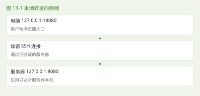

# 第 13 章 SSH 与远程服务器

> 本章任务｜确认远程身份，传一份文件，再解释隧道的两端。

## 13.1 在自己的电脑操作虚拟机

### 13.1.1 客户端与服务端

SSH 是 Secure Shell，提供加密的远程登录与相关通信。你电脑上的 ssh 是客户端，虚拟机上的 sshd 是服务端守护进程。服务端需要安装、运行并监听端口，客户端要能到达这个地址。先在虚拟机控制台查询 systemctl status sshd.service 与 ss -ltn，再从电脑连接。

NAT 网络若不允许宿主机直接访问来宾，可在虚拟化软件里把宿主机 127.0.0.1 的 2222 端口转发到来宾 22。绑定回环地址可以把实验入口限制在本机。不同虚拟化软件的操作界面不同，转发目标需匹配实际来宾地址与服务端口。

```bash
ssh -p 2222 alex@127.0.0.1
```

这条命令在宿主机终端运行，前提是已建立上述转发且账户名为 alex。-p 指定服务端口。若采用可直接访问的仅主机网络，则改用实际虚拟机地址与相应端口，不必保留 2222。[S14]



### 13.1.2 第一次连接为什么问指纹

第一次连接会显示服务器主机密钥指纹，用来确认对方身份。请在可信的虚拟机控制台查询相应主机公钥指纹，再与客户端展示的类型和值比较。ssh-keygen 是 SSH 密钥生成和管理工具，-l 显示指纹，-f 指定文件。例如服务器使用 Ed25519 主机密钥时，可由管理员读取对应公钥。

```bash
sudo ssh-keygen -lf /etc/ssh/ssh_host_ed25519_key.pub
```

只有确实存在这类密钥文件时才用该路径。不要把主机私钥传到客户端。后续若指纹变化，应先调查是否重装虚拟机、切换转发目标或存在其他风险，再决定更新 known_hosts，不能一律忽略提示。

## 13.2 用公钥登录

### 13.2.1 私钥留在客户端

```bash
mkdir -p ~/.ssh
chmod 700 ~/.ssh
ssh-keygen -t ed25519 -f ~/.ssh/linux-lab_ed25519
```

以上三行适用于 Linux、macOS 或 Git Bash 客户端；Windows PowerShell 用户应先建立自己的 .ssh 目录，再调用系统 OpenSSH 的 ssh-keygen，不能把 chmod 当成 Windows 文件权限配置。-t 指定密钥类型，-f 指定保存位置。若文件已存在，请改用新名称，不要覆盖已有密钥。设置口令可以进一步保护私钥。生成的 .pub 文件是公钥，可以添加到服务端用户的 ~/.ssh/authorized_keys；没有 .pub 后缀的是私钥，应留在客户端。

### 13.2.2 安装公钥后另开窗口验证

在支持 ssh-copy-id 的 Linux 客户端，可用它把指定公钥安装到服务器账户。名字可以按 copy SSH identity 理解。Windows 未必提供它，可通过已有可信连接把公钥作为一整行追加到服务器账户的 authorized_keys。不要覆盖文件中原有的其他公钥。

```bash
ssh-copy-id -i ~/.ssh/linux-lab_ed25519.pub \
  -p 2222 alex@127.0.0.1
ssh -i ~/.ssh/linux-lab_ed25519 \
  -p 2222 alex@127.0.0.1
```

服务端 ~/.ssh 通常设为 700，authorized_keys 通常设为 600，所有者应为该账户。具体认证还受服务端策略影响。在第二个窗口验证成功以前保留第一个会话，尤其不要提前关闭密码认证。公钥安装本身不要求修改 sshd_config；后面的端口转发还要单独检查策略。

## 13.3 传文件与建立隧道

### 13.3.1 scp 的端口是大写 P

scp 关联 secure copy，通过 SSH 传文件。下面在宿主机执行，把已有的 app.jar 上传到远程家目录。第 22 章会生成这个文件。

```bash
scp -P 2222 app.jar alex@127.0.0.1:app.jar
```

-P 是 scp 的端口选项，ssh 使用小写 -p，两者容易混淆。冒号分隔主机与远程路径，冒号后 app.jar 是相对远程用户家目录的路径。现代 OpenSSH 的 scp 默认使用 SFTP 传输，遇到老系统时不要用旧协议行为推断所有细节。[S14]

### 13.3.2 只让应用监听服务器本机

服务器上的 Java 服务若监听 127.0.0.1:8080，并且服务端允许相应转发，可从电脑建立本地转发。

```bash
ssh -N -o ExitOnForwardFailure=yes \
  -L 127.0.0.1:18080:127.0.0.1:8080 \
  -p 2222 alex@127.0.0.1
```

-N 不执行远程命令，-L 配置本地转发。ExitOnForwardFailure=yes 让建立转发监听失败时退出，例如本机 18080 已被占用；它不保证每次转发到应用的连接都成功。最左的 127.0.0.1:18080 是电脑上的监听位置，中间的 127.0.0.1:8080 从服务器一侧解释。隧道保持运行时，在电脑访问 http://127.0.0.1:18080/health 即可到达服务端的 /health。SSH 成功不保证应用端口存在，仍需按第 12 章检查。[S14]

### 13.3.3 登录成功，转发仍可能被拒绝

本次 SP4 实机的配置明确设置了 AllowTcpForwarding no。登录与文件传输正常，转发请求却被拒绝。因此，不能仅凭 ssh -N 仍在运行就判定隧道可用。由管理员检查服务端的有效配置。

```bash
sudo /usr/sbin/sshd -T | grep -E \
  '^(allowtcpforwarding|disableforwarding|permitopen) '
```

若存在 Match 规则，还要结合实际登录用户、客户端地址等条件，用 sshd -T -C 检查对应连接的结果。不要只看配置文件中某一行。确需完成本书实验时，由管理员先备份 /etc/ssh/sshd_config，检查已有规则，再在文件末尾为实际学习用户配置限定目标的本地转发。以下 alex 要换成真实账户名，不能直接套用于所有用户。[S31]

```text
Match User alex
    AllowTcpForwarding local
    PermitOpen 127.0.0.1:8080
```

这段是 sshd 配置文件内容，不是 Shell 命令。Match 后续的指令属于对应条件范围，不能在它后面随意追加全局配置。若已有更早的匹配项或其他限制，应由管理员合并核对。保存后先验证语法，成功才重新加载。

```bash
sudo /usr/sbin/sshd -t && sudo systemctl reload sshd
```

保留原管理会话，另建隧道并实际请求 /health。实验结束后，若这项授权只为测试而设，应恢复备份、再次检查语法并重新加载。本次验收只给独立测试账户临时开放该目标，验证结束已恢复原配置，没有关闭防火墙或 SELinux。

## 13.4 本章练习

- 不要往前翻｜主机密钥和用户登录密钥分别证明谁的身份？
- 命令填空｜scp 指定端口使用 ______，ssh 使用 ______。
- 看需求写命令｜通过 2222 端口以 alex 身份登录本机转发的虚拟机。
- 看命令猜结果｜在远程 SSH 提示符执行 pwd，显示哪台系统的目录？
- 找错误｜把私钥上传到服务器当作 authorized_keys 内容，错在哪里？
- 无提示实操｜建立可信登录，上传一个普通文本文件，核对内容，再正常退出。暂不关闭任何已有认证方式。

本章新命令为 ssh / Secure Shell、ssh-keygen / SSH key generation、ssh-copy-id / 公钥安装、scp / secure copy。退出远程 Shell 可以用 exit，意为退出。本次已在 SP4 核验密钥登录、文件传输与限定目标的隧道；其他安装方式的策略仍以实际配置为准。

资料依据见 S14、S27、S29。答案见第 13 章答案。
