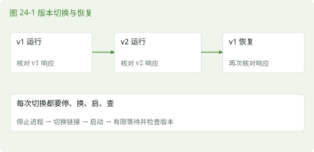

# 第 24 章 综合项目

> 本章任务｜部署 v1，切到 v2，再回滚并核对实际响应。

## 24.1 从一台新安装的 openEuler 开始

### 24.1.1 项目目标与验收证据

本章把前面的知识串成一次部署。结果应是一份由 systemd 管理、以普通服务用户运行的 Java 应用。它在本机响应 /health，通过 SSH 隧道可以从电脑访问，并能完成一次版本切换与回滚。

准备专用 openEuler 24.03 LTS SP4 虚拟机，创建普通学习账户并确认 sudo 授权，记录系统版本和架构。按第 9 章准备所需工具，按第 22 章安装 JDK 21。把第 22 章源文件及构建命令带入此机，生成 app.jar。每完成一阶段，记录命令、观察结果和异常，不要一次粘贴整章。

### 24.1.2 先检查本章名称是否空闲

```bash
getent passwd labapp
getent group labapp
ls -ld /opt/labapp /var/lib/labapp
systemctl status labapp.service --no-pager
```

这些对象在新实验机上应不存在，查询可能因此返回非零或“未找到”信息。如果已有同名对象，停止创建，调查其用途，不能把它们当作可覆盖的实验材料。下面假定这些名称均未被占用。

## 24.2 创建身份与发布目录

### 24.2.1 使用无交互登录需求的服务账户

先查询 nologin 的实际路径。nologin 用于拒绝交互式登录，不影响管理员按指定身份执行服务进程。useradd -r 建系统账户，-U 同时建同名组，-M 不自动创建家目录，-d 记录其家目录字段，-s 指定登录 Shell。

```bash
command -v nologin
```

以下假设核验结果是 /usr/sbin/nologin。若不同，先替换为实际路径。

```bash
sudo useradd -r -U -M -d /var/lib/labapp \
  -s /usr/sbin/nologin labapp
sudo install -d -o root -g root -m 0755 \
  /opt/labapp/releases/v1
sudo install -d -o labapp -g labapp -m 0750 \
  /var/lib/labapp
id labapp
```

install 是安装文件或目录的工具，可以在创建、复制时指定所有者、组和权限。-d 创建目录，-o 指定 owner，-g 指定 group，-m 指定模式。此处的 root 所有权限制服务进程改写发布文件，而数据目录允许 labapp 写入。

### 24.2.2 上传与安装产物

若在另一台机器构建，按第 13 章用 scp 上传到学习账户家目录，再用 sha256sum 比较上传前后的摘要。若在本虚拟机构建，直接使用已生成的文件。下面假定产物位于 ~/linux-lab/java-app/app.jar。

```bash
sha256sum ~/linux-lab/java-app/app.jar
sudo install -o root -g root -m 0644 \
  ~/linux-lab/java-app/app.jar /opt/labapp/releases/v1/app.jar
sudo ln -sT releases/v1 /opt/labapp/current
ls -l /opt/labapp/current
sudo -u labapp test -r /opt/labapp/current/app.jar
```

最后一条由 sudo 以 labapp 身份测试可读性，成功通常不输出。它验证文件访问，尚未证明 Java 能运行。当前软链接的相对目标从 /opt/labapp 解析，正好到 releases/v1。-T 把目标当成一个路径项；如果 current 已存在，应停下来调查，不能意外在它指向的目录中再创建链接。

## 24.3 先用服务身份前台运行

### 24.3.1 把程序错误与管理器错误分开

```bash
command -v java
sudo -u labapp /usr/bin/java -jar /opt/labapp/current/app.jar
```

此处假定 command -v java 已确认 /usr/bin/java 对应所需 JDK 21。若结果不同，后面单元也必须采用验证过的绝对路径。前台启动后，在另一个终端运行 curl -fsS http://127.0.0.1:8080/health。成功后 Ctrl+C 停止，确认端口已释放。这样可以在引入 systemd 之前证明身份、程序和端口的基本组合有效。

### 24.3.2 写入专用单元文件

建立部署目录并进入，然后把下一段保存为 labapp.service。

```bash
mkdir -p ~/linux-lab/deploy
cd ~/linux-lab/deploy
vim labapp.service
```

```ini
[Unit]
Description=Hola Euler teaching application
After=network.target

[Service]
Type=simple
User=labapp
Group=labapp
WorkingDirectory=/opt/labapp/current
ExecStart=/usr/bin/java -jar /opt/labapp/current/app.jar
Restart=on-failure
RestartSec=3
TimeoutStopSec=15
NoNewPrivileges=true
PrivateTmp=true
ProtectSystem=full
ProtectHome=true
UMask=0027
StandardOutput=journal
StandardError=journal

[Install]
WantedBy=multi-user.target
```

NoNewPrivileges 限制进程及后代通过执行程序获得新权限，PrivateTmp 提供私有临时目录视图，ProtectSystem=full 使若干系统路径只读，ProtectHome 限制访问家目录。它们不能替代应用安全设计，而且需要与程序真实写入需求相容。示例只读取 JAR 并输出日志，不在程序目录写文件。

### 24.3.3 等待应用真正就绪

Type=simple 的启动请求返回时，HTTP 接口可能还未就绪。下面的脚本最多尝试十次，同时检查响应正文和 HTTP 状态，避免把另一个版本误认成成功。准备 ~/linux-lab/scripts，把它保存为 wait-ready.sh。

```bash
mkdir -p ~/linux-lab/scripts
vim ~/linux-lab/scripts/wait-ready.sh
```

```bash
#!/usr/bin/env bash
if [ "$#" -ne 1 ]; then
  printf 'Usage: %s EXPECTED_VERSION\n' "$0" >&2
  exit 2
fi
expected="Hola Euler $1"
for attempt in {1..10}; do
  if body=$(curl -fsS --noproxy '*' \
      --connect-timeout 1 --max-time 2 \
      --write-out '\n%{http_code}' \
      http://127.0.0.1:8080/); then
    if [ "$body" = "$expected"$'\n\n200' ]; then
      printf 'Ready: %s\n' "$1"
      exit 0
    fi
  fi
  if [ "$attempt" -lt 10 ]; then sleep 1; fi
done
printf 'Not ready or wrong version: %s\n' "$1" >&2
exit 1
```

--noproxy '*' 让这个明确指向本机的请求不经过代理。--write-out 追加 HTTP 状态码，程序的正文自带一个换行，所以匹配值末尾含两个换行后接 200。$'\n' 是 Bash 的转义字符串语法。十次尝试耗尽仍未匹配时，先检查日志与版本指向，不继续下一次切换。

## 24.4 加载、启动与验收

### 24.4.1 先验证单元语法

```bash
sudo install -o root -g root -m 0644 \
  ~/linux-lab/deploy/labapp.service \
  /etc/systemd/system/labapp.service &&
  sudo systemd-analyze verify /etc/systemd/system/labapp.service &&
  sudo systemctl daemon-reload &&
  sudo systemctl enable --now labapp.service &&
  bash ~/linux-lab/scripts/wait-ready.sh v1
systemctl status labapp.service --no-pager
```

systemd-analyze 是 systemd 的分析工具，verify 检查单元定义。存在与本单元相关的错误时先修正，再继续。daemon-reload 更新管理器已读取的定义；enable --now 配置后续启动并立即启动。相关写入和启动操作需要管理员权限。

### 24.4.2 五份证据共同构成验收

```bash
systemctl is-active labapp.service
systemctl is-enabled labapp.service
ps -C java -o user,pid,ppid,args
ss -ltn
curl -fsS http://127.0.0.1:8080/health
sudo journalctl -u labapp.service -n 30 --no-pager
```

确认服务活动、启用状态符合预期，匹配的 Java 进程用户为 labapp，监听限定在 127.0.0.1:8080，健康正文为 ok，日志出现相应请求。ps -C java 可能列出多个 Java 进程，需要结合完整参数与 systemctl 主 PID 判断，不能把另一应用的进程误当成功证据。

从电脑建立第 13 章的 SSH 隧道，再访问本机 18080 端口。退出 SSH 登录后，服务应仍由 systemd 管理。是否在虚拟机重启后自动恢复，需要保存工作后自行安排一次重启验收；不要在共享服务器上为了验证而突然重启。

## 24.5 更新到 v2，再回到 v1

### 24.5.1 构建一个能辨认的新版本

把 LabServer.java 中的 String version = "v1" 改为 v2，按第 22 章重新编译与打包。先核对新 JAR 和版本记录，再安装到新的、此前不存在的版本目录。

```bash
test ! -e /opt/labapp/releases/v2 &&
  test ! -L /opt/labapp/releases/v2 &&
  sudo install -d -o root -g root -m 0755 \
    /opt/labapp/releases/v2 &&
  sudo install -o root -g root -m 0644 \
    ~/linux-lab/java-app/app.jar /opt/labapp/releases/v2/app.jar
```

确认上面的安装成功后再执行切换。

```bash
test -L /opt/labapp/current &&
  test ! -e /opt/labapp/current.next &&
  test ! -L /opt/labapp/current.next &&
  sudo systemctl stop labapp.service &&
  sudo ln -sT releases/v2 /opt/labapp/current.next &&
  sudo mv -Tf /opt/labapp/current.next /opt/labapp/current &&
  sudo systemctl start labapp.service &&
  bash ~/linux-lab/scripts/wait-ready.sh v2
```

执行前确认 current 是本章创建的软链接、current.next 不存在。-e 检查可解析的对象，-L 还能发现悬空链接，因此二者都要检查。&& 让前一步失败后停止后续步骤；没有输出的检查失败也应调查，不能跳过继续执行。GNU mv 的 -T 把目标当成一个路径项而非要进入的目录，-f 允许替换本章已确认的链接。切换前先停止服务，会带来短暂中断；这是单机教学流程，没有承诺零停机。此处只更换 JAR 指向，单元定义没变，无须额外 daemon-reload。

### 24.5.2 回滚需要再次验证

```bash
test -L /opt/labapp/current &&
  test ! -e /opt/labapp/current.next &&
  test ! -L /opt/labapp/current.next &&
  test -r /opt/labapp/releases/v1/app.jar &&
  sudo systemctl stop labapp.service &&
  sudo ln -sT releases/v1 /opt/labapp/current.next &&
  sudo mv -Tf /opt/labapp/current.next /opt/labapp/current &&
  sudo systemctl start labapp.service &&
  bash ~/linux-lab/scripts/wait-ready.sh v1
```

预期等待脚本输出 Ready: v1。再访问根路径时应重新看到 v1。切换中途失败可能让服务保持停止；先检查 current 与 current.next 的实际状态，保留失败现场，再恢复一个已验证版本，不能无条件继续粘贴后续命令。再次检查日志与健康接口。v1 文件仍保存在版本目录里，回滚没有依赖重新下载旧包。若将来加入数据写入，应额外处理数据格式兼容与备份。



> 提示｜current 指向哪里，决定下一次启动从哪里读取 JAR。已经运行的 JVM 不会因软链接改变而自动换成新版本。切换之后要重新启动，并用带版本的响应核对。

## 24.6 遇到失败时按证据收窄范围

### 24.6.1 常见故障与第一项检查

- 单元提示找不到用户，先用 id labapp 检查账户创建结果与单元拼写。
- Java 无法读取 JAR，先以 labapp 身份 test -r，再检查父路径权限和安全策略。
- 地址已使用，先 ss 查询监听，再识别拥有该端口的具体进程。
- 本机请求成功、电脑失败，先确认隧道仍运行、电脑访问端口正确。
- 服务不断重启，先 journalctl 查最早异常，必要时停止本服务以保留可读现场。
- 执行权限错误或 203/EXEC 一类状态，检查 ExecStart 的程序路径、可执行权限和相关拒绝日志。

### 24.6.2 保留实验结果

最后写一份项目记录，包含系统与 JDK 版本、产物摘要、目录权限、单元内容、启动证据和回滚结果。停止实验服务可用 sudo systemctl disable --now labapp.service，确认只影响自己建立的服务。无须删除账户、版本文件或整个实验目录来证明学完。

> 发布验收｜【待 openEuler 24.03 LTS SP4 实机验证】本章完整流程尚需在目标镜像上从零执行。作者批阅与技术验收分别记录，完成批阅后仍不能把未执行的测试填写为通过。

## 24.7 本章练习

- 不要往前翻｜为什么要先以 labapp 身份前台运行一次？
- 命令填空｜读取新单元定义使用 systemctl ______。
- 看需求写命令｜查看 labapp 的最近 50 条日志并检查健康接口。
- 看命令猜结果｜仅把 current 指向 v2，已经启动的 JVM 会自动重新加载整个 JAR 吗？
- 找错误｜状态显示 active 就停止检查，遗漏了哪些证据？
- 无提示实操｜从快照开始完成 v1 部署、v2 更新、v1 回滚，另一位读者只根据你的记录也能重做。

本章新命令为 install / 安装文件与目录、systemd-analyze / 管理器分析工具。全书使用过的路径、权限、进程、日志和网络在这里一起接受检验。

资料依据见 S09、S10、S20、S23、S24、S28、S29。答案见第 24 章答案。
